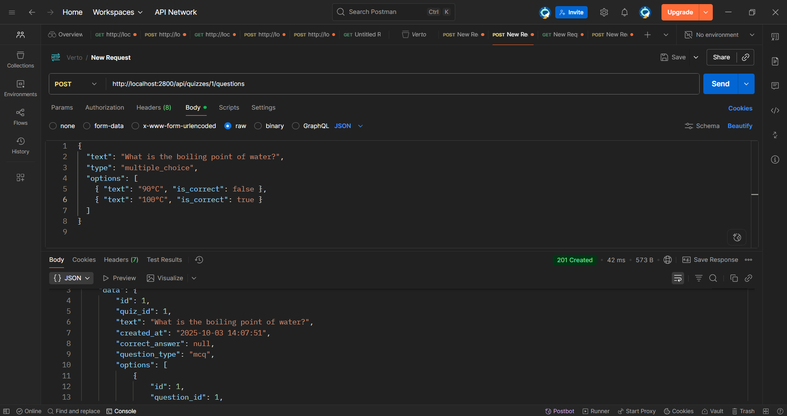

# quizAPI — Online Quiz Application API

A RESTful backend API for creating and taking quizzes, built with **Node.js**, **Express**, and **SQLite**.  
This is my submission for the **Associate Software Engineer (ASE) Challenge**.

---

## Overview & Motivation

This project provides the backend logic for a quiz system — create quizzes, add questions, take quizzes, and calculate scores.  
It demonstrates RESTful API design, clean architecture, and testing practices.

---

## Tech Stack

- **Language:** JavaScript
- **Runtime:** Node.js
- **Framework:** Express.js
- **Database:** SQLite
- **DB Library:** sqlite3
- **Testing:** Jest + Supertest

---

## Project Structure

```
quiz-api/
├── src/
│   ├── config/
│   │     └── database.js        
│   ├── controllers/
│   │     └── quiz.controller.js 
│   ├── routes/
│   │     └── quiz.routes.js     
│   ├── services/
│   │     └── quiz.service.js    
│   └── app.js                   
├── test/
│   └── quiz.routes.test.js  
├── .gitignore
├── index.js                     
├── package-lock.json
├── package.json
└── readme.md
```

---

##  Getting Started

### Prerequisites
- Node.js (v18.x or later recommended) [Nodejs](https://nodejs.org/en)
- npm (comes with Node.js)
- Postman [Postman](https://www.postman.com/)
- SQLite [SQLite](https://sqlite.org/2025/sqlite-tools-win-x64-3500400.zip)
- To install SQLite and configure you can refer to [YOUTUBE](https://www.youtube.com/watch?v=L3FwRRx6bqo) video
### Installation & Running Locally

```bash
# Clone the repo
git clone https://github.com/ThakarSairaj/quizAPI.git
```
```bash
# Change the working directory
cd quizAPI
```

```bash
# Install dependencies 
npm install
```
```bash
# Run to start the server
# Note: This will start the server and the database with "quizdb.db" will be created automatically in the root folder if it is not present there
npm run devStart
```

```bash
# If run "devStart" command doesnt work then try
npm start
```
##  Running Tests

```bash
# Command to run the tests
npm test
```
---

## API Endpoints

### Quiz Management

| Method | Route | Description | Example Body | Example Response |
|--------|-------|-------------|--------------|------------------|
| **POST** | `/api/quizzes` | Create a new quiz | ``` { "title": "My First Quiz" } ``` | ```{ "success": true, "data": { "id": 1, "title": "My First Quiz", "created_at": "2025-10-02T10:25:00Z" }, "message": "Quiz created successfully" } ``` |
| **POST** | `/api/quizzes/:id/questions` | Add a question (MCQ or text) | **MCQ:** ```{ "text": "What is 2+2?", "question_type": "mcq", "options": [ { "text": "3", "is_correct": false }, { "text": "4", "is_correct": true } ] } ``` **Text:** ``` { "text": "What is the capital of France?", "question_type": "text", "correct_answer": "Paris" } ``` | ```{ "success": true, "data": { "id": 1, "quiz_id": 1, "text": "What is 2+2?", "question_type": "mcq", "created_at": "2025-10-02T10:30:00Z", "options": [ { "id": 1, "question_id": 1, "text": "3", "is_correct": 0 }, { "id": 2, "question_id": 1, "text": "4", "is_correct": 1 } ] }, "message": "Question added successfully" } ``` |

### Quiz Taking

| Method | Route | Description | Example Body | Example Response |
|--------|-------|-------------|--------------|------------------|
| **GET** | `/api/quizzes/:id` | Fetch all questions for a quiz (without answers) | — | ```{ "success": true, "message": "Quiz questions retrieved successfully", "data": { "quiz": { "id": 1, "title": "My First Quiz", "created_at": "2025-10-02T10:25:00Z" }, "questions": [ { "id": 1, "quiz_id": 1, "text": "What is 2+2?", "question_type": "mcq", "options": [ { "id": 1, "question_id": 1, "text": "3" }, { "id": 2, "question_id": 1, "text": "4" } ] } ] } } ``` |
| **POST** | `/api/quizzes/:id/submit` | Submit answers & get score | ```{ "answers": [ { "question_id": 1, "question_type": "mcq", "selected_option_id": 2 }, { "question_id": 2, "question_type": "text", "text_answer": "Paris" } ] } ``` | ```{ "success": true, "message": "Quiz Submitted successfully", "data": { "score": 2, "total": 2, "percentage": 100, "userResult": [ { "question_id": 1, "correct": true }, { "question_id": 2, "correct": true } ] } } ``` |

---
## Running Tests

```bash
npm test
```

Tests cover core API endpoints (routes, validation, scoring).

---

# Screenshot of working API in Postman

**1 Creating Quiz**

```bash
HTTP Method :- POST
URL :- http://localhost:2800/api/quizzes
Body :- 
{ 
    "title": "GK Quiz" 
}

```
**2 Adding Question**

Screenshot 1



Screenshot 2


```bash
HTTP Method :- POST
URL :- http://localhost:2800/api/quizzes/1/questions
Body :- 
{ 
    {
    "text": "What is the boiling point of water?",
    "type": "multiple_choice",
    "options": [
        { "text": "90°C", "is_correct": false },
        { "text": "100°C", "is_correct": true }
    ]
    }

}

```

## What’s Done & What’s Next

### Completed
- Core endpoints (create quiz, add questions, fetch quiz, submit answers).
- SQLite-based persistence.
- Basic automated test cases.

### Planned / Bonus Features
- Add validation for question types (MCQ, text with 300-char limit, etc.).
- Endpoint to retrieve a list of all available quizzes.
- More detailed unit tests for scoring logic.


---

## Design Choices

- **Separation of concerns:** routes → controllers → services → database.  
- **Scoring logic:** compares submitted answers against DB and returns `{ score, total }`.  
- **SQLite:** lightweight DB choice, perfect for a self-contained challenge project.  

---